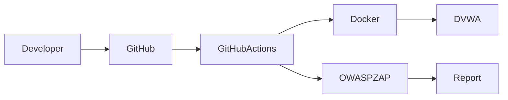

# DVWA ZAP Lab

> A hands-on DevSecOps laboratory for automating Dynamic Application Security Testing (DAST) with OWASP ZAP, Docker, and GitHub Actions.

---

## Overview

DVWA ZAP Lab demonstrates how Dynamic Application Security Testing (DAST) can be integrated into a modern CI/CD pipeline using GitHub Actions.

The workflow automatically deploys Damn Vulnerable Web Application (DVWA) inside a Docker container, executes an OWASP ZAP Baseline Scan, and generates an HTML security report that is uploaded as a workflow artifact.

This project is intended for educational purposes and provides a practical example of security automation within a DevSecOps workflow.

---

## Table of Contents

- [Overview](#overview)
- [Features](#features)
- [Architecture](#architecture)
- [Technologies](#technologies)
- [Repository Structure](#repository-structure)
- [Documentation](#documentation)
- [Prerequisites](#prerequisites)
- [Quick Start](#quick-start)
- [GitHub Actions Workflow](#github-actions-workflow)
- [Roadmap](#roadmap)
- [Contributing](#contributing)
- [License](#license)
- [References](#references)

---

## Features

- Automated OWASP ZAP Baseline Scan
- Dockerized DVWA deployment
- GitHub Actions integration
- HTML report generation
- CI/CD security automation
- Beginner-friendly security laboratory

---

## Learning Objectives

This laboratory demonstrates how to:

- Deploy a vulnerable web application using Docker.
- Automate Dynamic Application Security Testing (DAST).
- Integrate OWASP ZAP into GitHub Actions.
- Generate security reports automatically.
- Apply DevSecOps practices within CI/CD pipelines.
- Understand the fundamentals of OWASP ZAP Baseline Scan.

---

## Security Concepts Covered

- Dynamic Application Security Testing (DAST)
- Continuous Integration (CI)
- DevSecOps
- Container Security
- Security Automation
- Passive Security Testing
- Vulnerability Assessment
- Secure Software Development

---

## Architecture



---

## Technologies

| Category | Technology |
|----------|------------|
| CI/CD | GitHub Actions |
| DAST | OWASP ZAP |
| Vulnerable Application | DVWA |
| Containerization | Docker |
| Reporting | HTML |
| Language | YAML |

---

## Repository Structure

```text
dvwa-zap-lab/
│
├── .github/
│   └── workflows/
│       └── zap-scan.yml
│
├── docs/
│   ├── architecture.md
│   ├── workflow.md
│   ├── zap-baseline.md
│   └── screenshots/
│       └── .gitkeep
│
├── .gitignore
├── CHANGELOG.md
├── CODE_OF_CONDUCT.md
├── CONTRIBUTING.md
├── docker-compose.yml
├── LICENSE
├── README.md
└── SECURITY.md
```

---

## Documentation

Additional documentation is available in the `docs/` directory.

| Document | Description |
|----------|-------------|
| `architecture.md` | High-level architecture of the laboratory |
| `workflow.md` | Detailed explanation of the GitHub Actions workflow |
| `zap-baseline.md` | Guide to OWASP ZAP Baseline Scan and DAST concepts |

---

## Prerequisites

Before running this project locally, ensure you have the following installed:

- Docker Engine
- Docker Compose
- Git

---

## Quick Start

Clone the repository:

```bash
git clone https://github.com/YOUR_GITHUB_USERNAME/dvwa-zap-lab.git
```

Navigate to the project directory:

```bash
cd dvwa-zap-lab
```

Start DVWA:

```bash
docker compose up -d
```

Open your browser and access:

```text
http://localhost:8080
```

---

## GitHub Actions Workflow

The CI workflow performs the following steps:

1. Checks out the repository.
2. Starts the DVWA Docker container.
3. Waits until the application is available.
4. Executes an OWASP ZAP Baseline Scan.
5. Generates an HTML security report.
6. Uploads the report as a GitHub Actions artifact.

---

## Roadmap

Planned improvements include:

- Authenticated scanning
- OWASP ZAP Full Scan
- OWASP ZAP API Scan
- Scheduled weekly scans
- SARIF integration
- Security Dashboard
- Multi-container environment
- Slack or Microsoft Teams notifications

---

## Contributing

Contributions are welcome.

Please read the `CONTRIBUTING.md` document before submitting issues or pull requests.

---

## License

This project is licensed under the MIT License. See the `LICENSE` file for more information.

---

## References

- OWASP ZAP
- Damn Vulnerable Web Application (DVWA)
- Docker
- GitHub Actions
- OWASP Top 10
