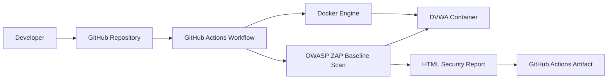

# Architecture

## Overview

The DVWA ZAP Lab demonstrates how Dynamic Application Security Testing (DAST) can be integrated into a modern DevSecOps workflow using GitHub Actions, Docker, and OWASP ZAP.

The architecture is intentionally simple to help learners understand the complete scanning pipeline while following software engineering and infrastructure automation best practices.

---

## High-Level Architecture



---

## Architecture Components

### Developer

The developer commits changes to the GitHub repository or manually triggers the workflow through GitHub Actions.

---

### GitHub Repository

The repository contains:

- GitHub Actions workflow
- Docker Compose configuration
- Documentation
- Project source files

GitHub acts as the central source of truth for the laboratory.

---

### GitHub Actions

GitHub Actions automates the complete security testing process.

Responsibilities include:

- Checking out the repository
- Starting the vulnerable application
- Verifying service availability
- Executing the OWASP ZAP Baseline Scan
- Generating the HTML report
- Uploading workflow artifacts

---

### Docker Engine

Docker provides an isolated execution environment.

Using containers ensures that every workflow execution starts from a clean and reproducible state.

---

### DVWA

Damn Vulnerable Web Application (DVWA) is the intentionally vulnerable web application used as the scan target.

DVWA includes common web application vulnerabilities for security training and testing purposes.

---

### OWASP ZAP

OWASP ZAP performs an automated Baseline Scan against DVWA.

The scan focuses primarily on passive analysis while generating a comprehensive HTML report.

---

### HTML Report

The generated report summarizes:

- Informational findings
- Warnings
- Medium-risk issues
- High-risk issues
- URLs analyzed
- Passive scan alerts

The report is produced automatically during every workflow execution.

---

### GitHub Artifacts

The generated HTML report is uploaded as a GitHub Actions artifact.

This allows the report to be downloaded and reviewed after the workflow completes.

---

## Workflow Sequence

```text
Developer

↓

Push / Pull Request / Manual Trigger

↓

GitHub Actions

↓

Checkout Repository

↓

Start Docker Container

↓

Wait for DVWA

↓

Execute ZAP Baseline Scan

↓

Generate HTML Report

↓

Upload Artifact
```

---

## Design Principles

The laboratory was designed following several engineering principles.

### Reproducibility

Every execution starts from a clean environment using Docker containers.

---

### Automation

Security testing is fully automated through GitHub Actions.

---

### Simplicity

The architecture minimizes complexity while demonstrating the essential concepts of DAST integration.

---

### Portability

The project can be executed locally using Docker Compose or automatically through GitHub Actions.

---

### Extensibility

The architecture is designed to support future enhancements, including:

- OWASP ZAP Full Scan
- Authenticated Scanning
- API Scanning
- Multiple vulnerable applications
- Security dashboards
- SARIF integration

---

## Architecture Benefits

This architecture demonstrates several DevSecOps practices:

- Automated DAST execution
- Infrastructure as Code principles
- Containerized testing
- CI/CD integration
- Security report generation
- Repeatable security testing
- Reproducible execution environments

---

## Future Architecture

Future versions of the project may include additional components.

```text
GitHub Actions

│

├── DVWA

├── OWASP Juice Shop

├── Vulnerable API

├── ZAP Full Scan

├── ZAP API Scan

└── Security Dashboard
```

This evolution would transform the project into a complete DevSecOps security testing laboratory supporting multiple targets and scanning profiles.
