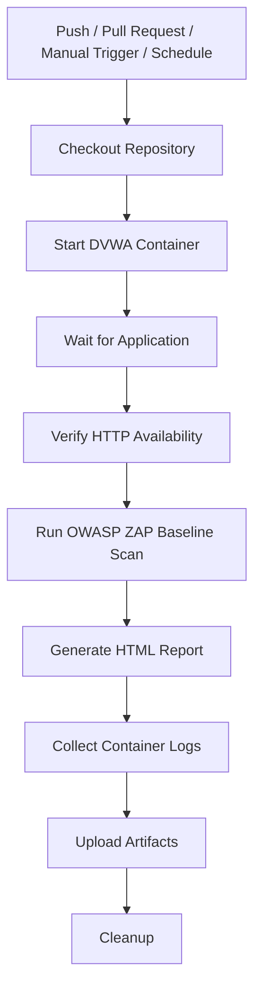

# GitHub Actions Workflow

## Overview

The DVWA ZAP Lab uses GitHub Actions to automate Dynamic Application Security Testing (DAST) with OWASP ZAP.

Each workflow execution deploys the vulnerable application inside a Docker container, verifies its availability, performs a security scan, generates an HTML report, and uploads the results as workflow artifacts.

This automated process demonstrates how DAST can be integrated into a modern DevSecOps CI/CD pipeline.

---

## Workflow Triggers

The workflow can be executed in several ways.

| Trigger | Description |
|----------|-------------|
| Push | Runs automatically when changes are pushed to the `main` branch. |
| Pull Request | Validates changes before they are merged. |
| Workflow Dispatch | Allows manual execution directly from GitHub Actions. |
| Schedule | Executes automatically every Monday at 03:00 UTC. |

---

## Workflow Diagram



---

## Workflow Steps

### 1. Checkout Repository

The workflow downloads the latest version of the repository into the GitHub Actions runner.

This ensures that all project files, including the workflow configuration and Docker Compose file, are available during execution.

---

### 2. Start DVWA Container

A Docker container is created using the official DVWA image.

The application is exposed on port **8080**.

This container serves as the target application for the security scan.

---

### 3. Wait for DVWA

Instead of waiting for a fixed amount of time, the workflow continuously checks whether the web application is responding.

This approach improves reliability because different environments may require different startup times.

---

### 4. Verify Application Availability

A final HTTP request confirms that DVWA is responding successfully before starting the security scan.

If the application is unavailable, the workflow stops and reports the error.

---

### 5. Execute OWASP ZAP Baseline Scan

The workflow launches an OWASP ZAP Docker container.

The Baseline Scan performs passive security testing without actively exploiting the application.

The scan produces an HTML report containing security findings and recommendations.

---

### 6. Generate Security Report

After the scan completes, OWASP ZAP creates an HTML report summarizing:

- Alerts
- Risk levels
- Affected URLs
- Security recommendations
- Informational findings

The report can be downloaded from GitHub Actions.

---

### 7. Collect Container Logs

The workflow saves the DVWA container logs.

These logs help troubleshoot startup issues or unexpected behavior during the scan.

---

### 8. Upload Artifacts

The following artifacts are uploaded:

- ZAP HTML Report
- DVWA Container Logs

Artifacts remain available after the workflow finishes.

---

### 9. Cleanup

The workflow stops and removes the Docker container.

Cleaning up resources ensures that every workflow execution starts from a fresh environment.

---

## Workflow Sequence

```text
Trigger

↓

Checkout Repository

↓

Start Docker Container

↓

Wait for Application

↓

Verify HTTP Response

↓

Run OWASP ZAP Baseline Scan

↓

Generate HTML Report

↓

Collect Logs

↓

Upload Artifacts

↓

Cleanup
```

---

## Why This Workflow?

This workflow demonstrates several DevSecOps practices:

- Security testing integrated into CI/CD
- Infrastructure automation
- Repeatable testing
- Containerized execution
- Automated reporting
- Reproducible environments

---

## Generated Artifacts

After a successful execution, GitHub Actions stores the following artifacts:

| Artifact | Description |
|----------|-------------|
| `zap-report.html` | OWASP ZAP HTML security report |
| `dvwa.log` | Docker container logs |

These artifacts can be downloaded directly from the workflow execution page.

---

## Future Improvements

Future versions of the workflow may include:

- Authenticated scanning
- OWASP ZAP Full Scan
- OWASP ZAP API Scan
- Parallel scan execution
- Security Quality Gates
- SARIF report generation
- GitHub Security integration
- Slack or Microsoft Teams notifications
- Multiple scan targets

---

## Learning Objectives

This workflow demonstrates practical concepts including:

- GitHub Actions automation
- Docker container orchestration
- Dynamic Application Security Testing (DAST)
- CI/CD security integration
- Automated report generation
- DevSecOps best practices
